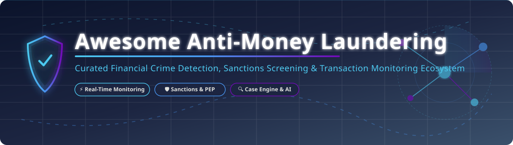
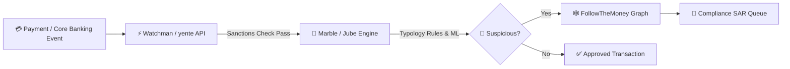

  

# 🛡️ Awesome Anti-Money Laundering (AML) Ecosystem

    

> 🚀 **Curated directory of enterprise SaaS platforms, open-source compliance software, transaction monitoring systems, sanctions screening APIs, and AI-driven financial crime detection engines.**

Welcome to the ultimate **Anti-Money Laundering (AML)** compliance resource guide! Whether you are a **Compliance Officer**, **Fintech Builder**, **AML Analyst**, or **Financial Crime Engineer**, this repository tracks industry-leading commercial suites and open-source tools required for regulatory compliance (BSA/AML, FATF, EU AMLD, OFAC).

---

## 📑 Table of Contents

- [📊 Market Overview & Industry Dynamics](#-market-overview--industry-dynamics)
- [🏢 SaaS & Commercial AML Platforms](#-saas--commercial-aml-platforms)
- [🔓 Open-Source GitHub Projects](#-open-source-github-projects)
- [🤝 How to Contribute](#-how-to-contribute)
- [💖 Support & Sponsorship](#-support--sponsorship)
- [📈 Star History](#-star-history)
- [⚠️ Regulatory Disclaimer](#️-regulatory-disclaimer)

---

## 📊 Market Overview & Industry Dynamics

> [!NOTE]  
> The global **Anti-Money Laundering (AML) software market size** is estimated at **$3.8 Billion – $4.2 Billion (2025–2026)** and is projected to reach **$8.5+ Billion by 2032**, expanding at a Compound Annual Growth Rate (CAGR) of ~15.5%.  
> **Market Structure:** The sector is **moderately fragmented**, featuring high-valuation incumbent enterprise conglomerates (*NICE Actimize, Feedzai*) serving Tier-1 global banks alongside agile, high-growth modern SaaS startups (*ComplyAdvantage, SEON, Unit21, Flagright*) catering to fintechs, crypto exchanges, and challenger banks.

---

## 🏢 SaaS & Commercial AML Platforms

The table below lists top enterprise Anti-Money Laundering platforms ranked by **Company Size / Valuation (Descending)**:

| Rank | 🏢 Platform | 💰 Pricing (Starting Tier) | 🎁 Free Tier / Trial Limit | 📊 Enterprise Size & Valuation | 🎯 Core Specialization & Key Features |
| :---: | :--- | :--- | :--- | :--- | :--- |
| **1** | **[NICE Actimize](https://www.niceactimize.com/)** | **$50,000+/yr** (Enterprise custom tier) | ❌ **No Free Trial** (Guided Demo on request) | 🏆 **~$2.0B Valuation** (Divisional Revenue: **$453.5M/yr**) | Enterprise AML suite, transaction monitoring, autonomous SAR filing, Tier-1 bank compliance. |
| **2** | **[Feedzai](https://www.feedzai.com/)** | **$35,000+/yr** (Enterprise contract base) | ❌ **No Free Trial** (Custom Proof-of-Concept / Demo) | 🦄 **$2.0B Valuation** ($75M Series E funding round) | AI RiskOps platform, real-time transaction monitoring, behavioral biometrics, payment fraud prevention. |
| **3** | **[Unit21](https://www.unit21.ai/)** | **$33,000/yr** (Starting custom tier) | ❌ **No Free Trial** (Interactive Demo on request) | 🚀 **$621.7M Valuation** ($45M+ Series C funding) | No-code rule engine, case management workflow, SAR/CTR automated filing, fintech compliance. |
| **4** | **[SEON](https://seon.io/)** | **$699/month** (Starter tier for 2,500 checks) | 🎁 **Forever Free Plan** (Up to 2,000 API calls/mo) + **14-Day Free Trial** | 🦄 **~$500M Valuation** (ARR: **$33M+**, Series C: $80M) | Digital footprint analysis, real-time AML watchlist screening, reverse social search, risk scoring API. |
| **5** | **[ComplyAdvantage](https://complyadvantage.com/)** | **$99/month** (Starter plan for 100 entities) | 🎁 **ComplyLaunch Program** (Free access for eligible early startups) | 📈 **~$350M–$450M Valuation** (Total Funding: **$170M+**) | Global sanctions screening, PEP & adverse media API, transaction screening, ongoing monitoring. |
| **6** | **[Silent Eight](https://www.silenteight.com/)** | **$25,000+/yr** (Enterprise custom tier) | ❌ **No Free Trial** (Custom Sandbox Pilot) | 💎 **~$134.6M Valuation** (Total Funding: **$55M+**) | AI alert resolution, automated name-matching investigation, reducing false positives in screening. |
| **7** | **[Lucinity](https://lucinity.com/)** | **$15,000+/yr** (Custom SaaS tier / Azure Marketplace) | ❌ **No Free Trial** (Interactive Sandbox Demo) | 💡 **~$60M–$80M Valuation** (Total Funding: **$25M+**, ARR: **$9.6M**) | Human-AI copilot ("Luci"), augmented AML case management, continuous transaction monitoring. |
| **8** | **[Napier AI](https://www.napier.ai/)** | **$12,000+/yr** (Custom contract base) | ❌ **No Free Trial** (Enterprise Demo on request) | 💼 **~$50M–$75M Valuation** (£45M Growth Equity round) | Intelligent compliance platform, AI typology rules, client lifecycle management (CLM). |
| **9** | **[Flagright](https://www.flagright.com/)** | **$500/month** (Base tier for fintechs) | 🎁 **First Year Free** (Eligible early-stage fintech startup program) | 🌱 **~$15M–$30M Valuation** (Seed Funding: **$4.3M**) | Real-time transaction monitoring API, automated customer risk scoring, no-code AML rules engine. |
| **10** | **[Sanction Scanner](https://www.sanctionscanner.com/)** | **$150/month** (Pay-per-query package bundles) | ❌ **No Free Trial** (Live Product Demo on request) | 🏢 **~$10M–$15M Valuation** (Estimated ARR: **$2.8M**) | Watchlist lookup API, PEP check software, real-time payment screening for SMBs and fintechs. |

---

## 🔓 Open-Source GitHub Projects

Explore production-ready open-source libraries, monitoring engines, and data pipelines sorted by **GitHub Stars (Descending)**:

| Repo & Link | Star Count | Language / Stack | Core Capabilities & Overview |
| :--- | :---: | :---: | :--- |
| 🛡️ **[OpenSanctions](https://github.com/opensanctions/opensanctions)**   | **812** | `Python` | International open database of sanctions list data, PEP lists, and persons of interest with ETL crawlers. |
| 🧠 **[Marble](https://github.com/checkmarble/marble)**   | **602** | `TypeScript` | Real-time decision engine for fraud prevention and AML transaction monitoring with an investigator UI. |
| 🔍 **[moov-io/watchman](https://github.com/moov-io/watchman)**   | **510** | `Go` | High-performance downloadable search engine for OFAC, EU, UN, and international sanctions lists & PEP checks. |
| ⚡ **[yente](https://github.com/opensanctions/yente)**   | **178** | `Python` | Open-source entity matching API for bulk sanctions screening and entity resolution using OpenSanctions datasets. |
| 📊 **[Jube](https://github.com/jube-home/aml-fraud-transaction-monitoring)**   | **111** | `Java` / `Python` | AGPL-licensed real-time transaction monitoring platform combining rule engines with Machine Learning scoring. |
| 🕸️ **[FollowTheMoney](https://github.com/opensanctions/followthemoney)**   | **100** | `Python` | Data model, entity graph definition, and CLI tools for financial crime investigations and link analysis. |
| 🎯 **[Sanctions Screening Benchmark](https://github.com/Divine16/Sanctions-screening-benchmark)**   | **34** | `Python` | Benchmark suite evaluating fuzzy name-matching algorithms across 18 variations (homoglyphs, typos, transliteration). |
| 🔬 **[AML ML Pipeline](https://github.com/dirumisra/aml-transaction-monitoring)**   | **1** | `Python` | Educational end-to-end Machine Learning pipeline featuring SHAP explainability for AML transaction monitoring. |

---

## 🛠️ Composable Open-Source Architecture Stack

---

## 🤝 How to Contribute

Contributions are highly encouraged to keep this directory up-to-date!

1. 🍴 **Fork** this repository.
2. 📝 **Add or update** entries in `README.md` following the table structure.
3. 🔎 Ensure all company figures, star badges, and links remain factual and working.
4. 🚀 **Submit a Pull Request (PR)** with a clear title and description.

---

## 💖 Support & Sponsorship

Thank you for exploring this curated Anti-Money Laundering compliance ecosystem! If you find this resource useful for your projects or compliance research, please consider supporting the project:

- ⭐ **Star** this repository to increase its visibility.
- 🔀 **Fork** and contribute new tools or updates.
- 📢 **Share** this list with compliance officers, fintech engineers, and colleagues.
- ☕ **Buy a Coffee / Sponsor**: Consider sponsoring via the [GitHub Sponsor Dashboard](https://github.com/sponsors/ishandutta2007) to help maintain and expand open compliance resources.

---

## 📈 Star History

---

## ⚠️ Regulatory Disclaimer

> [!CAUTION]  
> This directory is strictly for **informational and educational purposes**. Deploying open-source software or licensing commercial software does not automatically fulfill BSA/AML, PATRIOT Act, FATF, or EU AMLD statutory obligations. Compliance teams must conduct independent validation, policy reviews, and audit assessments with qualified regulatory counsel.

---

  <b>⭐ Star this repository if you find it helpful for your compliance research! ⭐</b>

